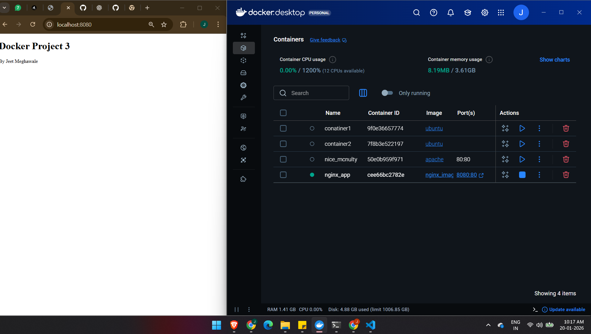

# Project Title
Building basic nginx app image

# Description
made a docker file which takes UBUNTU as base image
and install nginx on it
later copy our html code in it 
then run CMD commands

# Image

# Created by
Jeet Meghawale