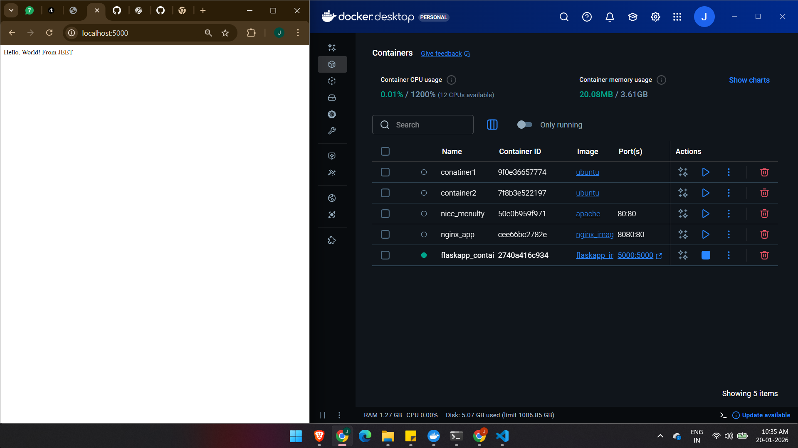

# Project Title
Building basic flask app image

# Description
- made a docker file which takes python as base image
- select work directory
- copy requiremnt
- pip install
- copy all files to image
- CMD

# Image

# Created by
Jeet Meghawale