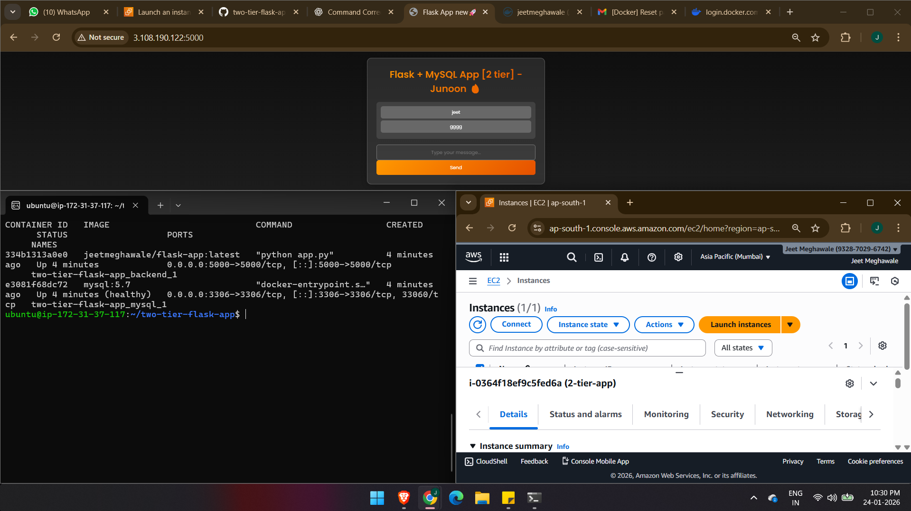

# Project Title

Flask App with MySQL Docker Setup

# Description

This is a simple Flask app that interacts with a MySQL database. The app allows users to submit messages, which are then stored in the database and displayed on the frontend.
- Deployed on EC2

# Image

# Created by
Jeet Meghawale 

